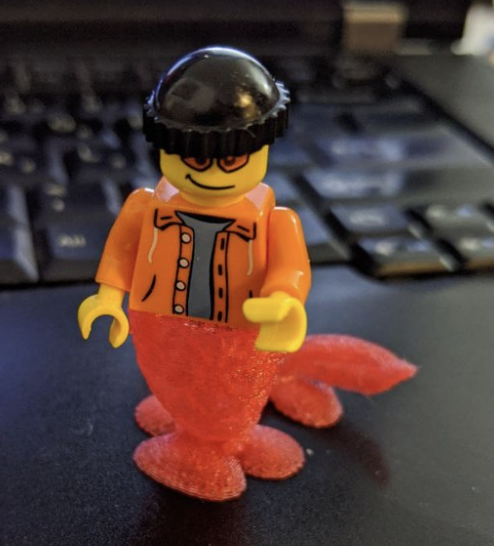

# Scientific Software: How to Build it Better

Lego is great. Why is it so great? 
- Lego is great because the pieces are simple. 
- Lego is great because you know how it works.
- Lego is great because it fits together so well.

Stacking rocks is hard. Why is it so hard?
- Stacking rocks hard because rocks come in all shapes and sizes.
- Stacking rocks is hard because you're not immediately sure how to do it best.
- Stacking rocks is hard because it requires balance and precision.

    

    <i>left</i>: a huge lego tower. <i>right</i>: isolated stacks of rocks.

You can build [almost anything](https://www.youtube.com/watch?v=QwXK4e4uqXY) with Lego.
The shapes of the your rocks dictate what you can build with them. 
It's fun to build lego with friends. 
Stacking rocks with friends could be fun, but it's more of a solo activity.

Where was I going with this... oh yeah, scientific software!

## The Problem with Scientific Software

Scientific software often sucks. It sucks because it's a stack 
of rocks built by a single person. Their last boss cared only how quickly they could build the tower. 
They only needed a quick snapshot of it standing tall. Their current boss? Well, their current boss wants a photo of a new stack of rocks on a different beach. 
Even if the builder cares about their old stack of rocks... keeping it standing doesn't pay the bills any more.
Even if the builder likes that people look at their stack of rocks... adding new rocks doesn't pay the bills any more.

## How to Build Scientific Software Better

Scientific software could be so much better. How we build matters.
We should be aiming to build our scientific software like we build with lego.
We use the pieces we have. Those pieces are tried, tested and solid. 
If we're doing something totally out there, maybe we could 3D print a custom brick or two.
You probably shouldn't be doing that much though.

    

    A custom 3D printed <a href="https://www.thingiverse.com/thing:4331945/files">mermaid tail</a> for your Lego minifigures

The great thing about Lego is that the interfaces between pieces are well defined and easy to understand.
If the architect of the Lego city we live in leaves town, someone could probably build a new hospital on the road at the edge of town. 
It's hard to build upwards on a stack of rocks.

## Concrete Advice

Let's move onto some actual advice...

### Build Simple

Build simple pieces. 
Build as few new pieces as possible. 
Make it obvious what things do.
Make it obvious how the pieces fit together. 

### Build Together

Lone geniuses can build great things. 
They can't and won't maintain them forever. 
You should try to build with other people. 
You can build bigger than you ever dreamed of. 
You will learn. 
You will have fun.

### Build to Standards

Nobody wants to spend time deciphering your mess, don't force them to unless it's absolutely necessary.
If there is an accepted way of doing things, you should probably do that.

### Build From the Bottom Up

Package small, useful modules whilst building your projects. 
You won't do it later. Your foundations must be solid. 
Other people will pick them up if they are useful.
Other people will maintain them if they can understand them.

## Closing

I feel strongly about this topic. 
It comes from a struggling against unnecessary complexity during my PhD.
I spent literal years trying to cobble together an image processing workflow. 
What I was trying to do looked simple, pass data between a few analysis tools.
In practice, it was painful. 
I spoke with many people who were in the same boat, unable to make the pieces fit together.
Nobody paid attention to the interfaces.

I learned Python and built [small modules to make things work](https://scholar.google.co.uk/citations?view_op=view_citation&hl=en&user=ERGSZbUAAAAJ&citation_for_view=ERGSZbUAAAAJ:W7OEmFMy1HYC). 
Since then, those packages have been used in a number of cool projects.

[*napari-animation*](https://github.com/napari/napari-animation) was used by Merlin Lange to make one of [*Nature*'s "sharpest science shots"](https://www.nature.com/immersive/d41586-022-03051-6/index.html)
for September 2022.

    

[*starfile*](https://github.com/teamtomo/starfile) was used by Brady Johnston to enable visualisations of cellular architecture in 
Blender via [Molecular Nodes](https://bradyajohnston.github.io/MolecularNodes/).

    

Utz Ermel and Huy Bui built some of their tools using mine.
They didn't have to reinvent the wheel. They got their science done.

    

I've since worked on a few projects that aren't built like Lego. It's a lot harder to make simple things work.

There is a better way! Please think about the way you are building. Thank you for reading.

